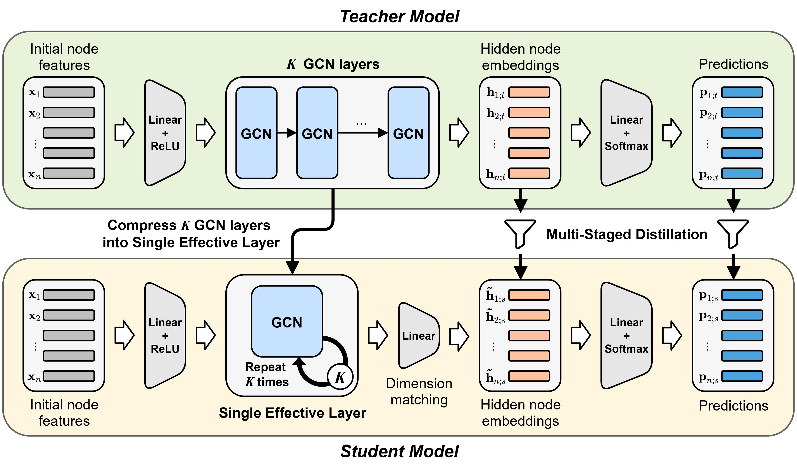

# Compressing Deep Graph Convolution Network with Multi-Staged Knowledge Distillation

## Abstract
Given a trained deep graph convolution network (GCN), how can we effectively compress it into a compact network without significant loss of accuracy? Compressing a trained deep GCN into a compact GCN is of great importance for implementing the model to environments such as mobile or embedded systems, which have limited computing resources. However, previous works for compressing deep GCNs do not consider the multi-hop aggregation of the deep GCNs, though it is the main purpose for their multiple GCN layers. In this work, we propose MustaD ( Mu lti- sta ged knowledge  D istillation), a novel approach for compressing deep GCNs to single-layered GCNs through multi-staged knowledge distillation (KD). MustaD distills the knowledge of 1) the aggregation from multiple GCN layers as well as 2) task prediction while preserving the multi-hop feature aggregation of deep GCNs by a single effective layer. Extensive experiments on four real-world datasets show that MustaD provides the state-of-the-art performance compared to other KD based methods. Specifically, MustaD presents up to 4.21%p improvement of accuracy compared to the second-best KD models.

## Overview

1. **Preserving Multi-hop Feature Aggregation**: MuSK preserves the feature aggregation procedure of deep GCN layers of the teacher in a single effective GCN layer of a student.
2. **Distilling Knowledge from Trained Deep GCNs**: MuSK distills the last hidden embeddings after K-hop aggregations of the teacher into the student. This distillation guides the student to follow the teacher’s behavior more carefully.
3. **Distilling Knowledge of Predictions**: The distillation of task prediction guides the student to obtain similar predictive outputs as the teacher.

## Code Description
- `src/citation/model.py`: Model architecture of GCNII.
- `src/citation/process.py`: Processing functions used on training.
- `src/citation/utils.py`: Utility functions for GCNII.
- `src/citation/student_train.py`: Trains a student GCNII model.
- `src/citation/teacher_train.py`: Trains a teacher GCNII model.
- `src/ogbn-proteins/model.py`: Model architecture of GEN.
- `src/ogbn-proteins/utils.py`: Utility functions for GEN.
- `src/ogbn-proteins/student_train.py`: Trains a student GEN model.
- `src/ogbn-proteins/teacher_train.py`: Trains a teacher GEN model.

## Data Overview
| **Dataset**      |                            **Path**                       | 
|:--------------:    |                          :----------:                      | 
|   **Cora**         |   `data/citation/ind.cora`   | 
| **Citeseer**     |    `data/citation/ind.citeseer`  | 
| **Pubmed**     | `data/citation/ind.pubmed`     | 
| **ogbn-proteins**     | `data/ogbn_proteins_pyg`  |  

- We load three citation benchmark datasets (Cora, Citeseer, and Pubmed).  The original datasets can be downloaded from [http://www.cs.umd.edu/~sen/lbc-proj/LBC.html](http://www.cs.umd.edu/~sen/lbc-proj/LBC.html).
    In our version, we use dataset splits provided by [Revisiting Semi-Supervised Learning with Graph Embeddings](https://github.com/kimiyoung/planetoid).
- We load the ogbn-proteins dataset from [https://ogb.stanford.edu/docs/nodeprop/](https://ogb.stanford.edu/docs/nodeprop/). When you first run our script, the dataset will be downloaded automatically. We use dataset splits provided by [DeeperGCN: All You Need to Train Deeper GCNs](https://github.com/lightaime/deep_gcns_torch/tree/master/examples/ogb).

## Citation Dataset

### Dependencies
- CUDA 10.1
- python 3.6.8
- pytorch 1.7.0
- torch-geometric 1.6.1
- scipy 1.5.4
- numpy 1.19.2

### Simple Demo
You can run the demo sript in the citation dataset by `bash citation.sh`.
It trains MuSK on Cora, Citeseer, and Pubmed.
This demo loads a pre-trained teacher model from `src/citation/teacher/teacher_{DATASET}{#LAYERS}.pth` and saves the trained student model at `src/citation/student/student_{DATASET}{#LAYERS}.pth`.
Then, it evaluates the trained model in terms of accuracy. 
- `{DATASET}`: cora, citeseer, pubmed.
- `{#LAYERS}`: The number of layers in the teacher model.

#### Results of the Demo
| **Dataset**      |   **Teacher Layers** |   **Accuracy** | 
|:--------------:    |:------:    |:------:    |
| **Cora**    | 64     | 84.70     |
| **Citeseer**   | 64     | 72.70     |
| **Pubmed**         | 64     | 80.04     |

#### Used Hyperparameters 
We briefly summarize the hyperparameters.

* Hyperparameters of MuSK
    - `data`: name of the dataset.
    - `layer`: number of layers in the teacher.
    - `test`: evaluation on test dataset.
    - `t_hidden`: teacher's hidden feature dimension.
    - `s_hidden`: student's hidden feature dimension.
    - `lamda`: lambda in GCNII.
    - `dropout`: ratio of dropout.
    - `lbd_pred`: lambda for the prediction loss.
    - `lbd_embd`: lambda for the embedding loss.
    - `kernel`: kernel function.

#### Detailed Usage
You can reproduce results with the following command:
```shell
python -u src/citation/student_train.py --data cora --layer 64 --test --lbd_pred 1 --lbd_embd 0.01 --kernel kl
python -u src/citation/student_train.py --data citeseer --layer 64 --t_hidden 256 --s_hidden 256 --lamda 0.6 --dropout 0.7 --test --lbd_pred 0.1 --lbd_embd 0.01 --kernel kl
python -u src/citation/student_train.py --data pubmed --layer 64 --t_hidden 256 --s_hidden 256 --lamda 0.4 --dropout 0.5 --wd1 5e-4 --test --lbd_pred 100 --lbd_embd 10 --kernel kl
```

The pre-trained teachers were generated by the following command:
```shell
python -u src/citation/teacher_train.py --data cora --layer 64 --test
python -u src/citation/teacher_train.py --data citeseer --layer 64 --hidden 256 --lamda 0.6 --dropout 0.7 --test
python -u src/citation/teacher_train.py --data pubmed --layer 64 --hidden 256 --lamda 0.4 --dropout 0.5 --wd1 5e-4 --test
```

### Reference Implementation
Codes are written based on [GCNII](https://github.com/chennnM/GCNII).


## ogbn-proteins Dataset

### Dependencies
- CUDA 10.0
- python 3.6.8
- pytorch 1.4.0
- torch-geometric 1.6.0
- ogb 1.2.1
- numpy 1.19.1

### Simple Demo
You can run the demo sript in ogbn-proteins by `bash ogbn-proteins.sh`.
It trains MuSK on ogbn-proteins.
This demo loads a pre-trained teacher model from `src/ogbn-proteins/teacher/teacher_ogbn{#LAYERS}.pth` and saves the trained student model at `./src/ogbn-proteins/student/student_ogbn{#LAYERS}.pth`.
Then, it evaluates the trained model in terms of ROC-AUC. 
- `{#LAYERS}`: The number of layers in the teacher model.

#### Results of the Demo
| **Dataset**      |   **Teacher Layers** |  **ROC-AUC** | 
|:--------------:    |:--------------:   | :------------:    |
| **ogbn-proteins**    | 28     | 0.823     |

#### Used Hyperparameters 
We briefly summarize the hyperparameters.

* Hyperparameters of MuSK
    - `layer`: number of layers in the teacher.
    - `hidden`: student's hidden feature dimension.
    - `lbd_pred`: lambda for the prediction loss.
    - `lbd_embd`: lambda for the embedding loss.
    - `train_bn`: train batch number.
    - `test_bn`: test batch number.

#### Detailed Usage
You can reproduce results with the following command:
```shell
python src/ogbn-proteins/student_train.py --lbd_pred 0.1 --lbd_embd 0.01 --hidden 64 --layer 28 --train_bn 40 --test_bn 5
```

The pre-trained teachers were generated by the following command:
```shell
python src/ogbn-proteins/teacher_train.py --lbd_pred 0.1 --lbd_embd 0.01 --hidden 64 --layer 28 --train_bn 40 --test_bn 5
```

### Reference Implementation
Codes are written based on [deeperGCN](https://github.com/lightaime/deep_gcns_torch) and pytorch-geometric (https://github.com/rusty1s/pytorch_geometric).
